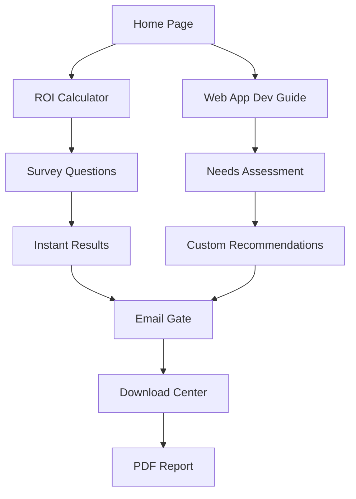

## 1. Product Overview
Two free tools to generate leads: ROI Calculator and Web App Development Guide. Both capture user information through surveys and provide downloadable reports/ebooks. These tools integrate with the main website to drive engagement and collect qualified leads.

## 2. Core Features

### 2.1 User Roles
| Role | Registration Method | Core Permissions |
|------|---------------------|------------------|
| Visitor | No registration required | Can access survey questions, view partial results |
| Lead User | Email capture during survey | Can complete full survey, download report/ebook |

### 2.2 Feature Module
Our free tools consist of the following main pages:
1. **ROI Calculator**: Interactive survey about business metrics, generates personalized ROI analysis report.
2. **Web App Development Guide**: Survey about development needs, generates customized development roadmap ebook.
3. **Download Center**: Secure page for accessing generated reports after email verification.

### 2.3 Page Details
| Page Name | Module Name | Feature description |
|-----------|-------------|---------------------|
| ROI Calculator | Survey Form | Collect business size, current costs, target improvements, timeline. Progress indicator shows completion status. |
| ROI Calculator | Instant Results | Display preliminary ROI calculations based on survey responses. Show estimated savings and payback period. |
| ROI Calculator | Email Gate | Require email address to unlock full detailed report. Include consent checkbox for marketing communications. |
| Web App Dev Guide | Needs Assessment | Survey about project scope, budget, timeline, technical requirements, team size. Multi-step form with validation. |
| Web App Dev Guide | Customized Recommendations | Generate technology stack suggestions, development phases, resource requirements based on survey. |
| Web App Dev Guide | Email Capture | Collect email before providing downloadable guide. Include option to subscribe to development tips newsletter. |
| Download Center | Report Access | Secure download page with PDF generation. Include share buttons and related resource suggestions. |
| Download Center | Email Verification | Send download link via email with expiration time. Track download status and user engagement. |

## 3. Core Process
**ROI Calculator Flow**: User lands on calculator → Completes 8-question survey → Views instant results → Enters email → Receives detailed PDF report via email → Can download from portal

**Web App Development Guide Flow**: User accesses guide → Answers project assessment questions → Views customized recommendations → Provides email → Downloads comprehensive development roadmap PDF

## 4. User Interface Design
### 4.1 Design Style
- Primary colors: Professional blue (#2563eb) and green (#059669) for trust and growth
- Button style: Rounded corners with subtle shadows, hover animations
- Font: Inter for body text, bold headings with clear hierarchy
- Layout: Card-based design with progress indicators, mobile-responsive forms
- Icons: Minimal line icons for survey questions and result displays

### 4.2 Page Design Overview
| Page Name | Module Name | UI Elements |
|-----------|-------------|-------------|
| ROI Calculator | Survey Form | Progress bar at top, card-based questions with radio buttons and input fields, real-time validation |
| ROI Calculator | Results | Charts showing ROI projections, savings breakdown, call-to-action for full report |
| Web App Dev Guide | Assessment | Multi-step form with category tabs, visual indicators for completion status |
| Download Center | Access Page | Clean layout with download button, sharing options, related resources grid |

### 4.3 Responsiveness
Desktop-first design with full mobile adaptation. Touch-optimized forms with larger tap targets on mobile devices. Responsive charts and tables for results display.

## 5. Lead Generation Features
- Email validation with double opt-in process
- Integration with CRM for lead scoring
- Automated follow-up email sequences
- Analytics tracking for conversion optimization
- A/B testing capabilities for form optimization