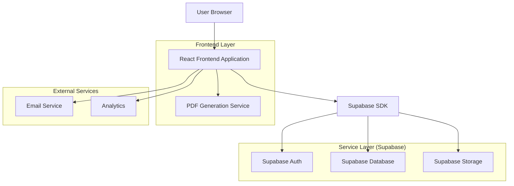
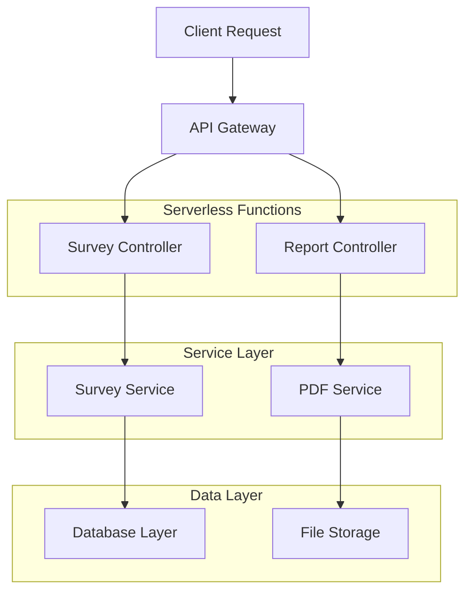
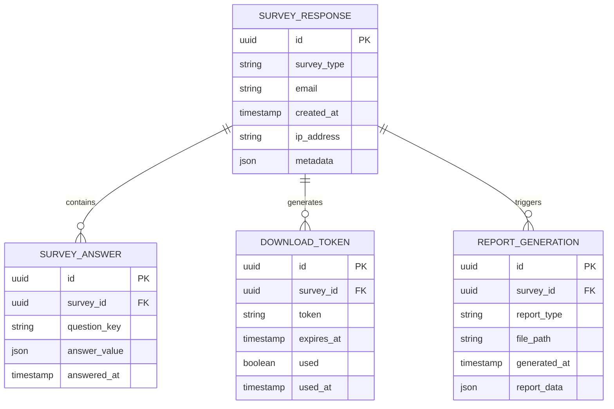

## 1. Architecture design



## 2. Technology Description
- Frontend: React@18 + tailwindcss@3 + vite
- Initialization Tool: vite-init
- Backend: Supabase (Authentication, Database, Storage)
- PDF Generation: jspdf + html2canvas
- Form Validation: react-hook-form + zod
- Charts: chart.js + react-chartjs-2

## 3. Route definitions
| Route | Purpose |
|-------|---------|
| /tools | Tools landing page with ROI Calculator and Web App Dev Guide cards |
| /tools/roi-calculator | Interactive ROI survey with real-time calculations |
| /tools/web-app-guide | Web development needs assessment survey |
| /tools/download-center | Secure download portal for reports |
| /api/generate-report | Backend endpoint for PDF generation (serverless function) |

## 4. API definitions

### 4.1 Survey Submission APIs

**ROI Calculator Submission**
```
POST /api/submit-roi-survey
```

Request:
| Param Name | Param Type | isRequired | Description |
|------------|------------|------------|-------------|
| company_size | string | true | Small/Medium/Large |
| current_monthly_cost | number | true | Current operational costs |
| target_improvement | string | true | Key area for improvement |
| timeline_months | number | true | Expected implementation timeline |
| email | string | true | User email address |

Response:
| Param Name | Param Type | Description |
|------------|------------|-------------|
| survey_id | string | Unique survey identifier |
| estimated_roi | number | Calculated ROI percentage |
| download_token | string | Secure token for report access |

**Web App Guide Submission**
```
POST /api/submit-dev-survey
```

Request:
| Param Name | Param Type | isRequired | Description |
|------------|------------|------------|-------------|
| project_scope | string | true | Project complexity level |
| budget_range | string | true | Budget category |
| timeline_urgency | string | true | Development timeline |
| technical_requirements | array | false | Specific tech stack needs |
| team_size | number | true | Development team size |
| email | string | true | User email address |

## 5. Server architecture diagram



## 6. Data model

### 6.1 Data model definition



### 6.2 Data Definition Language

**Survey Responses Table**
```sql
-- create table
CREATE TABLE survey_responses (
    id UUID PRIMARY KEY DEFAULT gen_random_uuid(),
    survey_type VARCHAR(50) NOT NULL CHECK (survey_type IN ('roi_calculator', 'web_app_guide')),
    email VARCHAR(255) NOT NULL,
    created_at TIMESTAMP WITH TIME ZONE DEFAULT NOW(),
    ip_address INET,
    metadata JSONB DEFAULT '{}',
    completed BOOLEAN DEFAULT false
);

-- create indexes
CREATE INDEX idx_survey_responses_email ON survey_responses(email);
CREATE INDEX idx_survey_responses_type ON survey_responses(survey_type);
CREATE INDEX idx_survey_responses_created ON survey_responses(created_at DESC);
```

**Survey Answers Table**
```sql
-- create table
CREATE TABLE survey_answers (
    id UUID PRIMARY KEY DEFAULT gen_random_uuid(),
    survey_id UUID REFERENCES survey_responses(id) ON DELETE CASCADE,
    question_key VARCHAR(100) NOT NULL,
    answer_value JSONB NOT NULL,
    answered_at TIMESTAMP WITH TIME ZONE DEFAULT NOW()
);

-- create indexes
CREATE INDEX idx_survey_answers_survey_id ON survey_answers(survey_id);
CREATE INDEX idx_survey_answers_question ON survey_answers(question_key);
```

**Download Tokens Table**
```sql
-- create table
CREATE TABLE download_tokens (
    id UUID PRIMARY KEY DEFAULT gen_random_uuid(),
    survey_id UUID REFERENCES survey_responses(id) ON DELETE CASCADE,
    token VARCHAR(255) UNIQUE NOT NULL,
    expires_at TIMESTAMP WITH TIME ZONE NOT NULL,
    used BOOLEAN DEFAULT false,
    used_at TIMESTAMP WITH TIME ZONE
);

-- create indexes
CREATE INDEX idx_download_tokens_token ON download_tokens(token);
CREATE INDEX idx_download_tokens_expires ON download_tokens(expires_at);
```

**Row Level Security Policies**
```sql
-- Grant basic access
GRANT SELECT ON survey_responses TO anon;
GRANT INSERT ON survey_responses TO anon;
GRANT SELECT ON survey_answers TO anon;
GRANT INSERT ON survey_answers TO anon;

-- Full access for authenticated users
GRANT ALL PRIVILEGES ON survey_responses TO authenticated;
GRANT ALL PRIVILEGES ON survey_answers TO authenticated;
GRANT ALL PRIVILEGES ON download_tokens TO authenticated;

-- RLS Policies
ALTER TABLE survey_responses ENABLE ROW LEVEL SECURITY;
ALTER TABLE survey_answers ENABLE ROW LEVEL SECURITY;
ALTER TABLE download_tokens ENABLE ROW LEVEL SECURITY;

-- Allow users to view their own responses
CREATE POLICY users_view_own_responses ON survey_responses
    FOR SELECT USING (email = auth.email());

-- Allow token verification
CREATE POLICY tokens_select_policy ON download_tokens
    FOR SELECT USING (true);
```