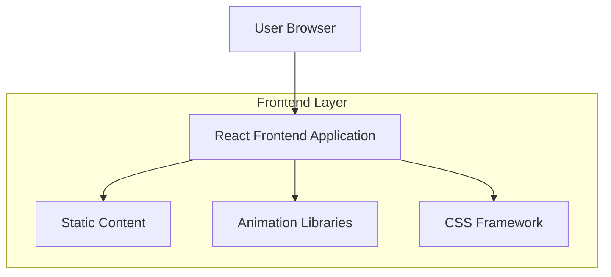

## 1. Architecture Design



## 2. Technology Description

* Frontend: React\@18 + tailwindcss\@3 + vite

* Initialization Tool: vite-init

* Backend: None (Static Site)

* Animation: framer-motion\@10

* Icons: lucide-react\@0.294

## 3. Route Definitions

| Route | Purpose                                                                         |
| ----- | ------------------------------------------------------------------------------- |
| /     | Homepage with all sections (hero, services, testimonials, clients, CTA, footer) |

## 4. Component Structure

### 4.1 Core Components

* `HeroSection.tsx` - Main hero with headline, CTA, and background animation

* `ServicesGrid.tsx` - Grid of service cards with icons and descriptions

* `Testimonials.tsx` - Client testimonials carousel/grid

* `ClientLogos.tsx` - Scrolling marquee of client logos

* `PrimaryCTA.tsx` - Prominent call-to-action section

* `Footer.tsx` - Footer with company info and links

### 4.2 Shared Components

* `Button.tsx` - Reusable button component with variants

* `Card.tsx` - Reusable card container

* `Container.tsx` - Layout container with max-width constraints

* `Typography.tsx` - Consistent text styling components

## 5. Data Structure

### 5.1 Static Data Files

```typescript
// data/services.ts
export interface Service {
  id: string;
  title: string;
  description: string;
  icon: string;
}

// data/testimonials.ts
export interface Testimonial {
  id: string;
  name: string;
  company: string;
  quote: string;
  rating: number;
  image?: string;
}

// data/clients.ts
export interface Client {
  id: string;
  name: string;
  logo: string;
}
```

### 5.2 Animation Configuration

```typescript
// config/animations.ts
export const fadeInUp = {
  initial: { opacity: 0, y: 60 },
  animate: { opacity: 1, y: 0 },
  transition: { duration: 0.6 }
};

export const staggerContainer = {
  animate: {
    transition: {
      staggerChildren: 0.1
    }
  }
};
```

## 6. Performance Considerations

* Lazy loading for images below the fold

* Optimized animations using CSS transforms

* Code splitting for better initial load

* Image optimization for client logos

* Prefetch critical resources

