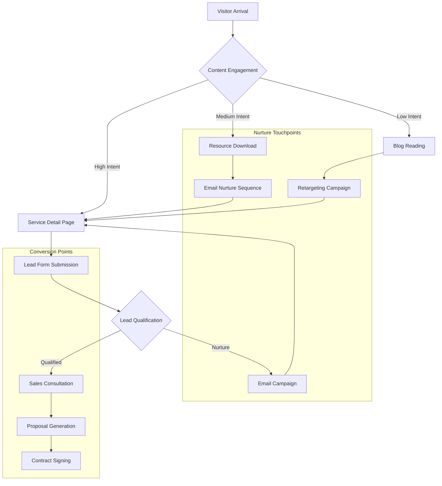

## 1. Product Overview

JOeve Smart Solutions is a comprehensive AI agency platform that transforms Malaysian SMEs through cutting-edge digital solutions. Our platform serves as a complete digital transformation hub, showcasing advanced AI services while providing an intuitive content management system for seamless business operations.

We empower businesses in Penang and across Malaysia to leverage AI technology for competitive advantage, offering everything from intelligent web applications to automated social media management and AI-generated video content. Our mission is to democratize AI technology for local businesses, making advanced digital transformation accessible and affordable.

## 2. Core Features

### 2.1 User Roles
| Role | Registration Method | Core Permissions |
|------|---------------------|------------------|
| Public Visitor | No registration required | Browse all content, submit forms, use chatbot, download resources |
| Qualified Lead | Form submission with email | Access to premium content, priority support, consultation booking |
| Admin | Supabase auth with admin role | Full CMS access, analytics, lead management, SEO optimization |
| Editor | Supabase auth with editor role | Content creation/editing, cannot delete or access analytics |
| Sales Team | Supabase auth with sales role | Lead management, CRM access, quotation generation |

### 2.2 Enhanced Feature Module

The enriched JOeve Smart Solutions platform consists of the following comprehensive pages:

1. **Enhanced Homepage**: Dynamic hero with value propositions, service showcase with detailed benefits, social proof sections, trust indicators, and conversion-optimized CTAs
2. **Services Hub**: Categorized service display with detailed descriptions, pricing tiers, case studies, and comparison tables
3. **Service Detail Pages**: Comprehensive service pages with problem-solution narratives, detailed process explanations, ROI calculators, and multiple conversion points
4. **Portfolio Showcase**: Filterable project gallery with detailed case studies, before/after comparisons, and client success metrics
5. **Resource Center**: Blog, whitepapers, guides, and tools for lead nurturing and SEO
6. **About Company**: Team profiles, company story, certifications, and trust-building content
7. **Contact & Quotation**: Multi-step forms with qualification questions and consultation booking
8. **AI Diagnostic Tool**: Interactive assessment tool with personalized recommendations
9. **Client Portal**: Login area for existing clients with project tracking and resources
10. **Admin Dashboard**: Enhanced CMS with analytics, A/B testing, and conversion tracking

### 2.3 Enriched Page Details

| Page Name | Module Name | Feature Description |
|-----------|-------------|---------------------|
| Enhanced Homepage | Value Proposition Hero | Animated headline showcasing "Transform Your Business with AI in 90 Days", subheadline emphasizing Penang's tech hub status, with credibility indicators (years in business, clients served, success rate) |
| Enhanced Homepage | Service Benefits Grid | Three core services with detailed benefit cards: Web Apps (increase efficiency 40%, reduce costs 30%), AI Social Media (10x engagement, 24/7 automation), Gen AI Videos (5x faster production, 80% cost reduction) |
| Enhanced Homepage | Social Proof Section | Client logos carousel, testimonial quotes with headshots, case study snippets with measurable results, industry certifications and partnerships |
| Enhanced Homepage | Trust Indicators | Security badges, data protection compliance, money-back guarantee, local support availability, free consultation offer |
| Enhanced Homepage | Conversion CTAs | Primary CTA: "Get Free AI Strategy Session", Secondary CTA: "Download AI Transformation Guide", Exit-intent popup for lead capture |
| Services Hub | Service Categories | Core Services (Web Development, AI Social Media, Gen AI Videos) and Supporting Solutions (Chatbots, Landing Pages, SEM, Jo Bizcard) with detailed descriptions and comparison tables |
| Services Hub | Pricing Overview | Transparent pricing tiers with feature comparisons, starting prices, ROI calculators, and "Contact for Custom Quote" options |
| Services Hub | Service Selection | Interactive service selector tool that recommends solutions based on business size, industry, and goals |
| Service Detail | Problem-Solution Narrative | Industry-specific pain points, current challenges, and how our AI solutions solve them with real examples and case studies |
| Service Detail | Process & Methodology | Step-by-step process explanation with timelines, deliverables, client involvement requirements, and success metrics |
| Service Detail | Features & Benefits | Detailed feature lists with corresponding benefits, competitive advantages, and unique value propositions |
| Service Detail | ROI Calculator | Interactive tool showing potential savings, efficiency gains, and revenue increases based on client inputs |
| Service Detail | Social Proof | Industry-specific testimonials, case studies with measurable results, client logos, and success metrics |
| Service Detail | Conversion Elements | Multiple CTAs throughout page, lead magnets (guides, checklists), consultation booking, and urgency indicators |
| Portfolio | Project Categories | Filter by service type, industry, business size, and project complexity with visual project cards and key metrics |
| Portfolio | Case Study Detail | Comprehensive project stories with challenges, solutions, implementation process, results, and client testimonials |
| Portfolio | Success Metrics | Before/after comparisons, ROI calculations, performance improvements, and timeline achievements |
| Resource Center | Content Library | Blog posts, whitepapers, case studies, guides, templates, and tools organized by topic and difficulty level |
| Resource Center | Lead Magnets | Downloadable resources requiring email capture: "AI Transformation Checklist", "Digital Marketing ROI Calculator", "Web App Development Guide" |
| Resource Center | SEO Optimization | Topic clusters, internal linking, schema markup, meta descriptions, and keyword-optimized content |
| About Company | Company Story | Founder's journey, company mission, values, culture, and commitment to Malaysian businesses |
| About Company | Team Expertise | Team member profiles with certifications, experience, specializations, and professional achievements |
| About Company | Trust Builders | Industry certifications, partnerships, awards, media mentions, and professional memberships |
| Contact & Quotation | Multi-Step Forms | Qualification questions, budget range, timeline, project scope, and preferred contact method |
| Contact & Quotation | Consultation Booking | Calendar integration for strategy sessions, demo bookings, and follow-up scheduling |
| Contact & Quotation | Response Guarantees | Commitment to respond within 24 hours, free consultation offers, and no-obligation quotes |
| AI Diagnostic | Interactive Assessment | Business size, industry, current challenges, technology readiness, and digital transformation goals |
| AI Diagnostic | Personalized Results | Customized recommendations, priority action items, potential ROI, and suggested next steps |
| AI Diagnostic | Lead Capture | Email requirement for detailed results, follow-up consultation offer, and resource downloads |
| Client Portal | Project Dashboard | Current project status, deliverables timeline, communication history, and resource access |
| Client Portal | Resource Library | Guides, tutorials, FAQs, support documentation, and training materials |
| Admin Dashboard | Analytics Dashboard | Traffic metrics, conversion rates, lead sources, popular content, and performance indicators |
| Admin Dashboard | A/B Testing | Page variant testing, CTA performance, form optimization, and conversion rate improvements |
| Admin Dashboard | SEO Management | Meta tag optimization, schema markup, keyword tracking, and search performance monitoring |

## 3. Core Process

### Customer Journey Flow
1. **Awareness Stage**: Visitors discover through search, social media, or referrals
2. **Interest Stage**: Engage with content, download resources, use diagnostic tools
3. **Consideration Stage**: Compare services, read case studies, request consultations
4. **Decision Stage**: Submit quotations, schedule demos, negotiate contracts
5. **Retention Stage**: Access client portal, provide feedback, refer others

### Lead Qualification Process
1. **Initial Capture**: Forms collect basic information and project requirements
2. **Automated Scoring**: System evaluates lead quality based on budget, timeline, and fit
3. **Sales Assignment**: High-quality leads assigned to sales team within 2 hours
4. **Follow-up Sequence**: Automated email sequence with relevant content and offers
5. **Conversion Tracking**: Monitor progress through sales pipeline to closure

## 4. User Interface Design

### 4.1 Enhanced Design Style
- **Primary Colors**: Cyan/teal (#00D4FF, #00B8D4) with gradient overlays and neon glow effects
- **Secondary Colors**: Deep blue (#001F3F, #003366) for backgrounds, white (#FFFFFF) for content areas
- **Accent Colors**: Magenta (#FF00FF) for CTAs, purple (#9B59B6) for highlights, gold (#FFD700) for premium elements
- **Typography**: Modern sans-serif (Inter/Plus Jakarta Sans), hierarchical sizing with strong contrast
- **Button Styles**: Gradient backgrounds with hover effects, rounded corners, compelling microcopy
- **Layout**: Card-based design with generous whitespace, clear visual hierarchy, and mobile-first responsive approach
- **Iconography**: Custom AI-themed icons, line-art style, consistent stroke width, meaningful metaphors
- **Animation**: Subtle parallax effects, smooth transitions, loading animations, and scroll-triggered reveals

### 4.2 Enriched Page Design Overview

| Page Name | Module Name | UI Elements |
|-----------|-------------|-------------|
| Enhanced Homepage | Hero Section | Full-screen video background with overlay, animated headline text, dual CTAs with contrasting colors, trust badges row, scroll indicator |
| Enhanced Homepage | Service Benefits | Three-column grid with icon animations, benefit-focused headlines, supporting statistics, and "Learn More" links |
| Enhanced Homepage | Social Proof | Logo carousel with smooth transitions, testimonial cards with client photos, rating stars, and company names |
| Enhanced Homepage | Conversion Zone | Contrasting background color, urgency elements (limited spots), guarantee badges, and multiple contact options |
| Services Hub | Service Cards | Hover effects with color changes, icon animations, pricing indicators, and "Most Popular" badges for featured services |
| Service Detail | Content Sections | Sticky navigation, progress indicators, interactive elements, embedded videos, and dynamic CTAs based on scroll position |
| Service Detail | ROI Calculator | Input sliders, real-time calculations, visual charts, and personalized result displays with contact CTAs |
| Portfolio | Project Grid | Masonry layout with hover overlays, category filters with smooth animations, and lazy loading for performance |
| Portfolio Detail | Case Study | Before/after image comparisons, timeline visualizations, metric counters, and testimonial callouts |
| Resource Center | Content Cards | Category tags, reading time indicators, download counts, author information, and related content suggestions |
| Contact Forms | Multi-Step Interface | Progress bars, field validation, smart defaults, conditional fields, and save-for-later functionality |
| AI Diagnostic | Assessment Tool | Progress indicators, interactive questions, visual results dashboard, and personalized action plans |

### 4.3 Responsiveness & Accessibility
- **Mobile-First Design**: Optimized for touch interactions, thumb-friendly navigation, and fast loading
- **Tablet Optimization**: Enhanced layouts for medium screens with touch-optimized elements
- **Desktop Enhancement**: Full feature utilization, hover effects, and rich interactions
- **Accessibility**: WCAG 2.1 compliance, keyboard navigation, screen reader support, and high contrast modes
- **Performance**: Lazy loading, image optimization, CDN integration, and Core Web Vitals optimization

### 4.4 Conversion Optimization
- **A/B Testing Framework**: Built-in testing for headlines, CTAs, layouts, and content variations
- **Heatmap Integration**: User behavior tracking, click analysis, and scroll depth monitoring
- **Form Optimization**: Multi-step forms, progressive profiling, and abandonment recovery
- **Personalization**: Dynamic content based on visitor behavior, referral source, and geographic location
- **Social Proof**: Real-time activity notifications, client counters, and urgency indicators

## 5. Content Strategy

### 5.1 SEO-Focused Content Structure
- **Service Pages**: 2,000+ words with keyword optimization, FAQ sections, and internal linking
- **Blog Content**: Topic clusters around AI transformation, digital marketing, and business automation
- **Resource Library**: Downloadable guides, checklists, templates, and whitepapers for lead generation
- **Case Studies**: Detailed project narratives with measurable results and client testimonials
- **Landing Pages**: Campaign-specific pages with dedicated tracking and conversion optimization

### 5.2 Lead Magnet Strategy
- **AI Transformation Checklist**: Step-by-step guide for business AI adoption
- **Digital Marketing ROI Calculator**: Interactive tool for measuring campaign effectiveness
- **Web App Development Guide**: Comprehensive resource for planning custom applications
- **Social Media Automation Playbook**: Strategies for 10x engagement improvement
- **Video Production Cost Estimator**: Budget planning tool with industry benchmarks

### 5.3 Testimonial & Social Proof
- **Industry-Specific Testimonials**: Targeted testimonials for different business sectors
- **Video Testimonials**: Client interview videos with before/after comparisons
- **Case Study Metrics**: Quantifiable results including ROI, time savings, and growth metrics
- **Client Logo Showcase**: Recognizable brands with permission-based display
- **Award & Recognition**: Industry certifications, partnerships, and media mentions

This enriched documentation provides comprehensive guidance for creating landing pages that effectively communicate value, build trust, and drive conversions through detailed service information, compelling CTAs, extensive social proof, and SEO-optimized content.