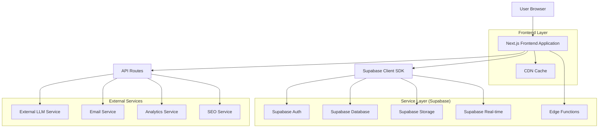
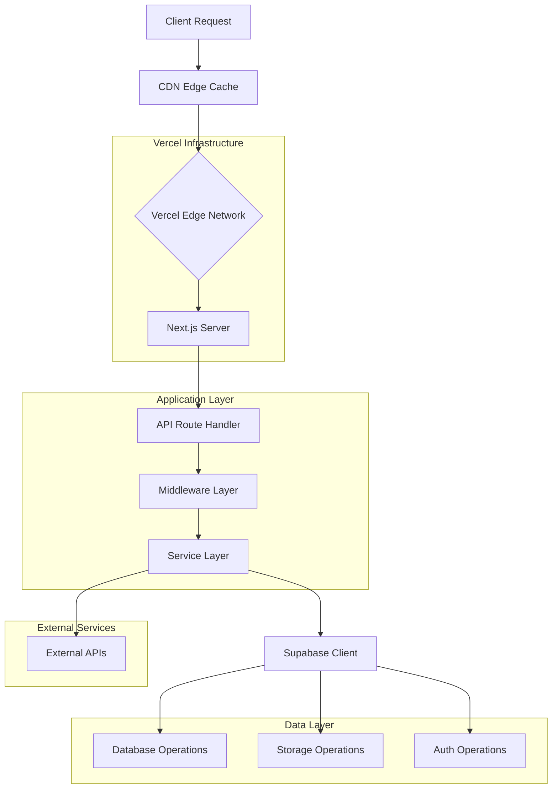
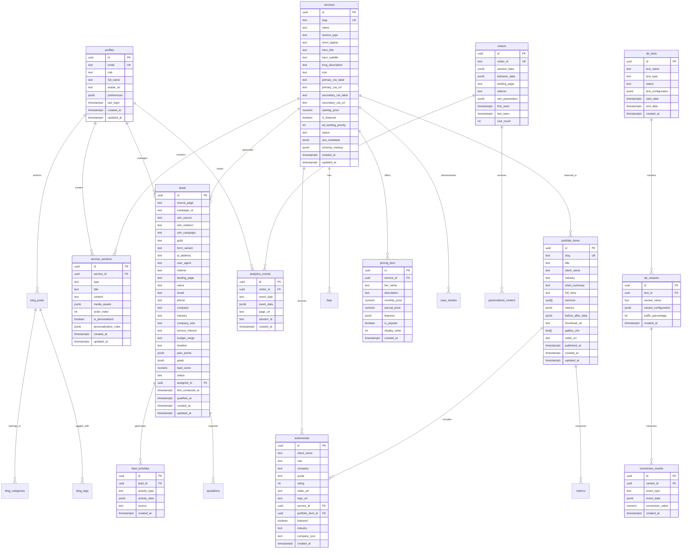

## 1. Enhanced Architecture Design



## 2. Enhanced Technology Stack

### Frontend Technologies
- **Framework**: Next.js 14 (App Router) + TypeScript
- **Styling**: Tailwind CSS + Framer Motion for animations
- **UI Components**: Custom component library with Radix UI primitives
- **Forms**: React Hook Form + Zod validation
- **State Management**: Zustand for client state, SWR for server state
- **Analytics**: Google Analytics 4 + Microsoft Clarity for heatmaps
- **SEO**: Next.js SEO plugin + Schema.org markup

### Backend & Services
- **Database**: Supabase PostgreSQL with Row Level Security
- **Authentication**: Supabase Auth with role-based access control
- **Storage**: Supabase Storage for images, documents, and media files
- **Real-time**: Supabase Real-time for live updates and notifications
- **Edge Functions**: Supabase Edge Functions for serverless computing
- **Email**: Resend for transactional emails + Mailchimp for marketing
- **LLM Integration**: OpenAI GPT-4 for chatbot and content generation
- **CDN**: Cloudflare for global content delivery and edge caching

### Development Tools
- **Initialization**: create-next-app with TypeScript template
- **Package Manager**: npm with package-lock.json for dependency management
- **Linting**: ESLint with Next.js configuration
- **Formatting**: Prettier with custom configuration
- **Type Checking**: TypeScript strict mode enabled
- **Testing**: Jest + React Testing Library for unit tests
- **Deployment**: Vercel with automatic deployments from GitHub

## 3. Enhanced Route Definitions

### Public Routes
| Route | Purpose | SEO Focus |
|-------|---------|-----------|
| `/` | Enhanced homepage with conversion optimization | Primary keywords: "AI agency Penang", "digital transformation Malaysia" |
| `/services` | Services overview with pricing and comparisons | Service-related keywords, comparison content |
| `/services/[slug]` | Detailed service pages with rich content | Long-tail keywords, solution-focused content |
| `/portfolio` | Project showcase with case studies | Portfolio keywords, industry-specific terms |
| `/portfolio/[slug]` | Individual project case studies | Project-specific keywords, success stories |
| `/blog` | Content marketing hub | Blog keywords, informational content |
| `/blog/[slug]` | Individual blog posts | Article-specific keywords, topic clusters |
| `/resources` | Resource library with lead magnets | Resource keywords, download-focused content |
| `/about` | Company information and team | Brand keywords, trust-building content |
| `/contact` | Contact and quotation forms | Contact keywords, location-based content |
| `/ai-diagnostic` | Interactive assessment tool | Diagnostic keywords, tool-focused content |
| `/testimonials` | Client reviews and ratings | Review keywords, social proof content |

### Admin Routes
| Route | Purpose | Features |
|-------|---------|----------|
| `/admin/login` | Enhanced admin authentication | Two-factor authentication, session management |
| `/admin/dashboard` | Analytics and overview | KPI dashboard, conversion tracking, performance metrics |
| `/admin/services` | Service management | Rich content editor, SEO optimization, A/B testing |
| `/admin/portfolio` | Project management | Image optimization, case study builder, metrics tracking |
| `/admin/testimonials` | Review management | Video testimonials, rating aggregation, social proof |
| `/admin/blog` | Content management | SEO optimization, content calendar, publishing workflow |
| `/admin/leads` | CRM and lead management | Lead scoring, pipeline tracking, automated follow-ups |
| `/admin/analytics` | Advanced analytics | User behavior, conversion funnels, A/B test results |
| `/admin/seo` | SEO management | Meta tags, schema markup, keyword tracking, sitemap |
| `/admin/settings` | Site configuration | Global settings, integrations, backup management |

## 4. Enhanced API Definitions

### 4.1 Lead Capture API (Enhanced)

```
POST /api/leads/enhanced
```

Request:

| Param Name | Param Type | isRequired | Description |
|------------|------------|------------|-------------|
| name | string | true | Client full name |
| email | string | true | Business email address |
| phone | string | false | Contact number with country code |
| company | string | false | Company name and website |
| industry | string | false | Business sector/industry |
| company_size | string | false | Number of employees |
| service_interest | string | true | Primary service of interest |
| budget_range | string | false | Investment budget range |
| timeline | string | false | Project timeline expectations |
| pain_points | array | false | Specific business challenges |
| goals | array | false | Desired outcomes and objectives |
| source_page | string | true | Landing page URL |
| utm_source | string | false | Marketing campaign source |
| utm_medium | string | false | Marketing medium |
| utm_campaign | string | false | Campaign name |
| gclid | string | false | Google Click ID for tracking |
| form_variant | string | false | A/B test variant identifier |

Response:

| Param Name | Param Type | Description |
|------------|------------|-------------|
| success | boolean | Operation status |
| lead_id | string | Unique lead identifier |
| lead_score | number | Quality score (1-100) |
| recommended_services | array | AI-suggested services |
| next_steps | object | Automated follow-up actions |
| message | string | Success/error message |

Example Request:

```json
{
  "name": "Sarah Lim",
  "email": "sarah@manufacturing-solutions.my",
  "phone": "+60123456789",
  "company": "Manufacturing Solutions Sdn Bhd",
  "industry": "manufacturing",
  "company_size": "50-100",
  "service_interest": "web-app-software-development",
  "budget_range": "RM50k-100k",
  "timeline": "3-6 months",
  "pain_points": ["manual processes", "data silos", "reporting delays"],
  "goals": ["automate workflows", "real-time analytics", "cost reduction"],
  "source_page": "/services/web-app-software-development",
  "utm_source": "google",
  "utm_medium": "cpc",
  "utm_campaign": "ai-transformation-q1-2024",
  "gclid": "CjwKCAjw...",
  "form_variant": "long-form-v2"
}
```

### 4.2 Content Personalization API

```
POST /api/content/personalize
```

Request:

| Param Name | Param Type | isRequired | Description |
|------------|------------|------------|-------------|
| visitor_id | string | true | Anonymous visitor identifier |
| page_url | string | true | Current page URL |
| industry | string | false | Visitor's industry (if known) |
| company_size | string | false | Company size category |
| previous_interactions | array | false | Previous page visits and actions |

Response:

| Param Name | Param Type | Description |
|------------|------------|-------------|
| personalized_headlines | array | Customized hero messages |
| relevant_services | array | Service recommendations |
| social_proof | object | Industry-specific testimonials |
| ctas | array | Optimized call-to-action buttons |
| content_blocks | array | Personalized content sections |

### 4.3 SEO Management API

```
POST /api/seo/optimize
```

Request:

| Param Name | Param Type | isRequired | Description |
|------------|------------|------------|-------------|
| content_type | string | true | Type of content (service, blog, portfolio) |
| content_id | string | true | Content identifier |
| target_keywords | array | true | Primary and secondary keywords |
| content | string | true | Raw content for optimization |

Response:

| Param Name | Param Type | Description |
|------------|------------|-------------|
| optimized_title | string | SEO-optimized title tag |
| meta_description | string | Optimized meta description |
| schema_markup | object | Structured data markup |
| content_suggestions | array | Content improvement recommendations |
| keyword_density | object | Keyword usage analysis |

## 5. Enhanced Server Architecture



### 5.1 Middleware Layer Components
- **Authentication Middleware**: JWT validation and session management
- **Rate Limiting**: API request throttling and DDoS protection
- **Caching Layer**: Redis-based caching for frequently accessed data
- **Validation Layer**: Input sanitization and business rule validation
- **Logging Service**: Structured logging with error tracking
- **Analytics Middleware**: Event tracking and user behavior monitoring

### 5.2 Service Layer Components
- **Lead Scoring Service**: ML-based lead qualification and scoring
- **Email Service**: Transactional and marketing email orchestration
- **Content Service**: Dynamic content generation and personalization
- **SEO Service**: Automated SEO optimization and monitoring
- **Notification Service**: Real-time notifications and alerts
- **Integration Service**: Third-party service integrations and webhooks

## 6. Enhanced Data Model

### 6.1 Extended Database Schema



### 6.2 Enhanced Data Definition Language

#### Enhanced Services Table

```sql
-- Create enhanced services table
CREATE TABLE services (
    id UUID PRIMARY KEY DEFAULT gen_random_uuid(),
    slug TEXT UNIQUE NOT NULL,
    name TEXT NOT NULL,
    service_type TEXT CHECK (service_type IN ('core', 'supporting', 'premium')) DEFAULT 'supporting',
    short_tagline TEXT,
    hero_title TEXT,
    hero_subtitle TEXT,
    long_description TEXT,
    key_benefits JSONB DEFAULT '[]',
    features JSONB DEFAULT '[]',
    process_steps JSONB DEFAULT '[]',
    icon TEXT,
    hero_image_url TEXT,
    primary_cta_label TEXT DEFAULT 'Get Free Consultation',
    primary_cta_url TEXT DEFAULT '/contact',
    secondary_cta_label TEXT,
    secondary_cta_url TEXT,
    starting_price NUMERIC(10,2),
    pricing_model TEXT CHECK (pricing_model IN ('fixed', 'hourly', 'retainer', 'performance')),
    typical_timeline TEXT,
    success_metrics JSONB DEFAULT '[]',
    is_featured BOOLEAN DEFAULT false,
    ad_landing_priority INT DEFAULT 100,
    seo_title TEXT,
    seo_description TEXT,
    seo_keywords TEXT[],
    schema_markup JSONB DEFAULT '{}',
    status TEXT CHECK (status IN ('draft', 'published', 'archived')) DEFAULT 'draft',
    created_at TIMESTAMPTZ DEFAULT NOW(),
    updated_at TIMESTAMPTZ DEFAULT NOW()
);

-- Create indexes for performance
CREATE INDEX idx_services_slug ON services(slug);
CREATE INDEX idx_services_type ON services(service_type);
CREATE INDEX idx_services_featured ON services(is_featured);
CREATE INDEX idx_services_status ON services(status);
CREATE INDEX idx_services_created_at ON services(created_at DESC);

-- Grant permissions
GRANT SELECT ON services TO anon;
GRANT ALL ON services TO authenticated;
```

#### Enhanced Leads Table with Scoring

```sql
-- Create enhanced leads table
CREATE TABLE leads (
    id UUID PRIMARY KEY DEFAULT gen_random_uuid(),
    source_page TEXT NOT NULL,
    campaign_id TEXT,
    utm_source TEXT,
    utm_medium TEXT,
    utm_campaign TEXT,
    utm_term TEXT,
    utm_content TEXT,
    gclid TEXT,
    fbclid TEXT,
    form_variant TEXT,
    visitor_id TEXT,
    session_id TEXT,
    ip_address INET,
    user_agent TEXT,
    referrer TEXT,
    landing_page TEXT,
    name TEXT NOT NULL,
    email TEXT NOT NULL,
    phone TEXT,
    company TEXT,
    industry TEXT,
    company_size TEXT CHECK (company_size IN ('1-10', '11-50', '51-200', '201-500', '500+')),
    service_interest TEXT,
    budget_range TEXT CHECK (budget_range IN ('<RM10k', 'RM10k-50k', 'RM50k-100k', 'RM100k-500k', '>RM500k')),
    timeline TEXT CHECK (timeline IN ('<1 month', '1-3 months', '3-6 months', '6-12 months', '>12 months')),
    pain_points JSONB DEFAULT '[]',
    goals JSONB DEFAULT '[]',
    current_solution TEXT,
    decision_maker BOOLEAN DEFAULT false,
    urgency_level INT CHECK (urgency_level >= 1 AND urgency_level <= 5),
    lead_score NUMERIC(5,2) DEFAULT 0.00,
    lead_grade TEXT GENERATED ALWAYS AS (
        CASE 
            WHEN lead_score >= 80 THEN 'A'
            WHEN lead_score >= 60 THEN 'B'
            WHEN lead_score >= 40 THEN 'C'
            WHEN lead_score >= 20 THEN 'D'
            ELSE 'F'
        END
    ) STORED,
    status TEXT CHECK (status IN ('new', 'contacted', 'qualified', 'proposal_sent', 'negotiation', 'won', 'lost', 'nurture')) DEFAULT 'new',
    assigned_to UUID REFERENCES profiles(id),
    first_contacted_at TIMESTAMPTZ,
    qualified_at TIMESTAMPTZ,
    converted_at TIMESTAMPTZ,
    notes TEXT,
    follow_up_date DATE,
    created_at TIMESTAMPTZ DEFAULT NOW(),
    updated_at TIMESTAMPTZ DEFAULT NOW()
);

-- Create performance indexes
CREATE INDEX idx_leads_email ON leads(email);
CREATE INDEX idx_leads_status ON leads(status);
CREATE INDEX idx_leads_lead_grade ON leads(lead_grade);
CREATE INDEX idx_leads_assigned_to ON leads(assigned_to);
CREATE INDEX idx_leads_created_at ON leads(created_at DESC);
CREATE INDEX idx_leads_follow_up_date ON leads(follow_up_date);
CREATE INDEX idx_leads_visitor_id ON leads(visitor_id);

-- Grant permissions
GRANT SELECT ON leads TO anon;
GRANT ALL ON leads TO authenticated;
```

#### Analytics Events Table

```sql
-- Create analytics events table
CREATE TABLE analytics_events (
    id UUID PRIMARY KEY DEFAULT gen_random_uuid(),
    visitor_id TEXT NOT NULL,
    session_id TEXT NOT NULL,
    event_type TEXT NOT NULL,
    event_category TEXT,
    event_action TEXT,
    event_label TEXT,
    event_value NUMERIC,
    event_data JSONB DEFAULT '{}',
    page_url TEXT,
    page_title TEXT,
    referrer TEXT,
    user_agent TEXT,
    screen_resolution TEXT,
    viewport_size TEXT,
    timezone TEXT,
    country TEXT,
    region TEXT,
    city TEXT,
    device_type TEXT CHECK (device_type IN ('desktop', 'tablet', 'mobile')),
    browser TEXT,
    operating_system TEXT,
    created_at TIMESTAMPTZ DEFAULT NOW()
);

-- Create performance indexes
CREATE INDEX idx_analytics_events_visitor_id ON analytics_events(visitor_id);
CREATE INDEX idx_analytics_events_session_id ON analytics_events(session_id);
CREATE INDEX idx_analytics_events_event_type ON analytics_events(event_type);
CREATE INDEX idx_analytics_events_created_at ON analytics_events(created_at DESC);
CREATE INDEX idx_analytics_events_page_url ON analytics_events(page_url);

-- Grant permissions
GRANT SELECT ON analytics_events TO anon;
GRANT ALL ON analytics_events TO authenticated;
```

## 7. Enhanced Supabase Configuration

### 7.1 Environment Variables

```bash
# Core Supabase Configuration
NEXT_PUBLIC_SUPABASE_URL=https://[your-project].supabase.co
NEXT_PUBLIC_SUPABASE_ANON_KEY=[your-anon-key]
SUPABASE_SERVICE_ROLE_KEY=[your-service-role-key]

# External Service Integrations
AI_API_KEY=[openai-api-key]
RESEND_API_KEY=[resend-api-key]
MAILCHIMP_API_KEY=[mailchimp-api-key]
GOOGLE_ANALYTICS_ID=G-XXXXXXXXXX
MICROSOFT_CLARITY_ID=[clarity-project-id]

# SEO & Marketing
GOOGLE_SEARCH_CONSOLE_ID=[search-console-id]
GOOGLE_TAG_MANAGER_ID=GTM-XXXXXXX
FACEBOOK_PIXEL_ID=[facebook-pixel-id]
LINKEDIN_INSIGHT_TAG=[linkedin-tag-id]

# Performance & Security
CLOUDFLARE_ZONE_ID=[cloudflare-zone-id]
CLOUDFLARE_API_TOKEN=[cloudflare-token]
REDIS_URL=[redis-connection-url]
RATE_LIMIT_REQUESTS_PER_MINUTE=60
```

### 7.2 Storage Buckets Configuration

```sql
-- Create storage buckets with proper policies
INSERT INTO storage.buckets (id, name, public, file_size_limit, allowed_mime_types) VALUES
('portfolio-images', 'portfolio-images', true, 52428800, ARRAY['image/jpeg', 'image/png', 'image/webp', 'image/gif']),
('blog-images', 'blog-images', true, 10485760, ARRAY['image/jpeg', 'image/png', 'image/webp']),
('testimonial-videos', 'testimonial-videos', true, 104857600, ARRAY['video/mp4', 'video/webm']),
('service-assets', 'service-assets', true, 20971520, ARRAY['image/jpeg', 'image/png', 'image/svg+xml']),
('lead-magnet-files', 'lead-magnet-files', true, 52428800, ARRAY['application/pdf', 'application/msword', 'application/vnd.openxmlformats-officedocument.wordprocessingml.document']);

-- Grant public read access to all buckets
GRANT SELECT ON storage.objects TO anon;
GRANT INSERT ON storage.objects TO authenticated;
GRANT UPDATE ON storage.objects TO authenticated;
GRANT DELETE ON storage.objects TO authenticated;
```

### 7.3 Row Level Security (RLS) Policies

```sql
-- Enable RLS on all tables
ALTER TABLE services ENABLE ROW LEVEL SECURITY;
ALTER TABLE service_sections ENABLE ROW LEVEL SECURITY;
ALTER TABLE portfolio_items ENABLE ROW LEVEL SECURITY;
ALTER TABLE testimonials ENABLE ROW LEVEL SECURITY;
ALTER TABLE leads ENABLE ROW LEVEL SECURITY;
ALTER TABLE analytics_events ENABLE ROW LEVEL SECURITY;
ALTER TABLE ab_tests ENABLE ROW LEVEL SECURITY;

-- Public read access for published content
CREATE POLICY "Public read for published services" ON services
    FOR SELECT USING (status = 'published');

CREATE POLICY "Public read for published service sections" ON service_sections
    FOR SELECT USING (
        EXISTS (
            SELECT 1 FROM services 
            WHERE services.id = service_sections.service_id 
            AND services.status = 'published'
        )
    );

-- Admin full access with role checking
CREATE POLICY "Admin full access on services" ON services
    FOR ALL USING (
        EXISTS (
            SELECT 1 FROM profiles 
            WHERE profiles.id = auth.uid() 
            AND profiles.role IN ('admin', 'editor')
        )
    );

-- Lead management policies
CREATE POLICY "Sales team can view all leads" ON leads
    FOR SELECT USING (
        EXISTS (
            SELECT 1 FROM profiles 
            WHERE profiles.id = auth.uid() 
            AND profiles.role IN ('admin', 'sales')
        )
    );

CREATE POLICY "Sales team can update leads" ON leads
    FOR UPDATE USING (
        EXISTS (
            SELECT 1 FROM profiles 
            WHERE profiles.id = auth.uid() 
            AND profiles.role IN ('admin', 'sales')
        )
    );

-- Analytics data access
CREATE POLICY "Admin can view analytics" ON analytics_events
    FOR SELECT USING (
        EXISTS (
            SELECT 1 FROM profiles 
            WHERE profiles.id = auth.uid() 
            AND profiles.role = 'admin'
        )
    );
```

### 7.4 Performance Optimization

```sql
-- Create materialized views for performance
CREATE MATERIALIZED VIEW service_performance_summary AS
SELECT 
    s.id,
    s.name,
    s.slug,
    COUNT(DISTINCT l.id) as total_leads,
    COUNT(DISTINCT CASE WHEN l.status = 'won' THEN l.id END) as converted_leads,
    AVG(l.lead_score) as avg_lead_score,
    COUNT(DISTINCT p.id) as portfolio_items,
    COUNT(DISTINCT t.id) as testimonials,
    AVG(t.rating) as avg_rating
FROM services s
LEFT JOIN leads l ON s.slug = l.service_interest
LEFT JOIN portfolio_items p ON s.id = ANY(p.services)
LEFT JOIN testimonials t ON s.id = t.service_id
WHERE s.status = 'published'
GROUP BY s.id, s.name, s.slug;

-- Create indexes for common queries
CREATE INDEX idx_leads_composite ON leads(service_interest, status, created_at DESC);
CREATE INDEX idx_analytics_events_composite ON analytics_events(event_type, created_at DESC);
CREATE INDEX idx_services_search ON services USING gin(to_tsvector('english', name || ' ' || COALESCE(long_description, '')));

-- Refresh materialized view periodically
CREATE OR REPLACE FUNCTION refresh_service_performance()
RETURNS void AS $$
BEGIN
    REFRESH MATERIALIZED VIEW CONCURRENTLY service_performance_summary;
END;
$$ LANGUAGE plpgsql;
```

## 8. Monitoring & Analytics

### 8.1 Performance Monitoring
- **Core Web Vitals**: LCP < 2.5s, FID < 100ms, CLS < 0.1
- **API Response Times**: 95th percentile < 500ms
- **Database Query Performance**: Slow query monitoring and optimization
- **Error Tracking**: Sentry integration for real-time error monitoring
- **Uptime Monitoring**: 99.9% uptime SLA with status page

### 8.2 Business Intelligence
- **Lead Conversion Tracking**: End-to-end conversion funnel analysis
- **Content Performance**: Page views, engagement time, and conversion rates
- **A/B Test Results**: Statistical significance testing and winner selection
- **ROI Calculation**: Marketing spend vs. revenue attribution
- **Customer Lifetime Value**: Long-term value tracking and optimization

This enhanced technical architecture provides a robust foundation for implementing the enriched landing pages with advanced features like personalization, A/B testing, comprehensive analytics, and conversion optimization while maintaining excellent performance and scalability.