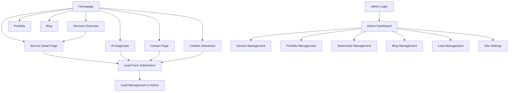

## 1. Product Overview
JOeve Smart Solutions is a production-ready marketing website and CMS for a Malaysian AI agency specializing in three core services: Web App & Software Development, Social Media Generation, and Gen AI Video Production. The platform serves as a comprehensive digital presence that showcases services, manages content, captures leads, and provides an AI-powered chatbot for customer engagement.

The product targets SME clients in Malaysia seeking AI-driven digital transformation solutions, providing them with clear service information, portfolio showcases, and easy contact channels while enabling the agency team to manage all content through an integrated CMS.

## 2. Core Features

### 2.1 User Roles
| Role | Registration Method | Core Permissions |
|------|---------------------|------------------|
| Public Visitor | No registration required | Browse all public content, submit contact forms, use chatbot |
| Admin | Supabase auth with admin role | Full CMS access: create/edit/delete all content, view leads, manage settings |
| Editor | Supabase auth with editor role | Create/edit content, cannot delete or access settings |
| Viewer | Supabase auth with viewer role | Read-only access to CMS content |

### 2.2 Feature Module
The JOeve Smart Solutions website consists of the following main pages:

1. **Homepage**: Hero section with 3 core services, company value proposition, case studies showcase, supporting solutions preview, and floating chatbot
2. **Services Overview**: Lists all services separated into core and supporting categories with navigation to individual service pages
3. **Service Detail Pages**: Dynamic pages for each service with detailed content sections, testimonials, FAQs, and lead capture forms
4. **Portfolio**: Showcase of completed projects with filtering by service type and detailed project pages
5. **Blog**: Content marketing with category filtering and individual article pages
6. **About**: Company information and team details
7. **Contact**: Contact information and quotation request form
8. **AI Diagnostic**: Embedded diagnostic tool from ai.joevesmartsolutions.com with lead capture
9. **Admin Dashboard**: Complete CMS for managing all content types including services, portfolio, testimonials, blog posts, leads, and site settings

### 2.3 Page Details
| Page Name | Module Name | Feature description |
|-----------|-------------|---------------------|
| Homepage | Hero Section | Display futuristic neon cityscape with main headline highlighting AI-driven digital potential in Penang, Malaysia, featuring 3 core service cards with hover effects and CTA button |
| Homepage | Core Services Display | Three prominent cards showcasing Web App Development, AI Social Media Generation, and Gen AI Video Production with neon tech illustrations and direct navigation |
| Homepage | Supporting Solutions | Horizontal pipeline display of additional services: Chatbots, Landing Pages, SEM, Jo Bizcard with neon connector styling |
| Homepage | Testimonials Carousel | Auto-rotating client testimonials with speech bubble design, navigation arrows, and client avatar placeholders |
| Homepage | AI Studio Banner | Promotional section linking to ai.joevesmartsolutions.com with robot imagery and AI orb graphics |
| Homepage | Contact CTA | Prominent magenta/purple glowing CTA section encouraging digital transformation contact |
| Homepage | Chatbot Widget | Floating bottom-right chatbot with AI_API_KEY integration, system prompt about 3 core services, and lead capture functionality |
| Services | Service Categories | Clear separation of core services vs supporting solutions with visual distinction and filtering capabilities |
| Service Detail | Dynamic Content Sections | Problem identification, benefits showcase, process explanation, pricing information, FAQs, testimonials, and lead forms based on service_sections data |
| Service Detail | Lead Capture | Integrated quotation request form capturing name, email, company, budget range, and project details with automatic lead assignment |
| Portfolio | Project Grid | Filterable showcase of completed projects with thumbnail images, client names, industries, and service tags |
| Portfolio Detail | Project Story | Full project narrative with metrics display, image gallery, service connections, and client testimonial integration |
| Blog | Article Listing | Chronological blog post display with category filtering, featured images, excerpts, and read time indicators |
| Blog Detail | Article Content | Full markdown content rendering, author information, related posts, and social sharing capabilities |
| AI Diagnostic | Embedded Tool | Integration of ai.joevesmartsolutions.com diagnostic tool with lead capture form posting to /api/leads |
| Admin Dashboard | Service Management | Create/edit/delete services with slug generation, section ordering, status management, and featured service designation |
| Admin Dashboard | Portfolio Management | Project creation with image upload, service tagging, metrics input, and publishing workflow |
| Admin Dashboard | Testimonial Management | Client testimonial creation with company logos, service associations, and featured testimonial selection |
| Admin Dashboard | Blog Management | Article creation with markdown editor, category assignment, author selection, and publishing controls |
| Admin Dashboard | Lead Management | Lead viewing with status tracking, filtering by source and service interest, and contact status updates |
| Admin Dashboard | Site Settings | Global configuration management for contact information, social links, and site-wide settings |

## 3. Core Process

### Public User Flow
Users arrive at the homepage where they're immediately presented with the 3 core services through visually striking cards. They can explore individual service pages for detailed information, view the portfolio for past work examples, read blog content for industry insights, or use the chatbot for immediate assistance. Lead capture occurs through multiple touchpoints: service page forms, contact page, AI diagnostic tool, and chatbot interactions.

### Admin User Flow
Admins authenticate through Supabase to access the CMS dashboard. From there, they can manage all content types: create new services with detailed sections, add portfolio projects with images and metrics, publish testimonials and blog posts, monitor incoming leads, and configure site-wide settings. All changes are immediately reflected on the public website.

## 4. User Interface Design

### 4.1 Design Style
- **Primary Colors**: Cyan/teal (#00D4FF, #00B8D4) with neon glow effects
- **Secondary Colors**: Deep blue gradients (#001F3F to #003366) for backgrounds
- **Accent Colors**: Magenta/purple (#FF00FF, #9B59B6) for CTAs and special highlights
- **Typography**: Futuristic sans-serif, all-caps for headings, regular case for body text
- **Button Style**: Rounded rectangles with strong outer glow effects, white bold text on colored backgrounds
- **Layout**: Card-based design with neon tech illustrations, holographic elements, and grid line accents
- **Icon Style**: Neon glow effects, tech-inspired designs, connected node pipelines for supporting services
- **Animation**: Subtle hover effects on cards, smooth transitions, floating elements for futuristic feel

### 4.2 Page Design Overview
| Page Name | Module Name | UI Elements |
|-----------|-------------|-------------|
| Homepage | Hero Section | Full-width neon cityscape background with cyan grid lines, large uppercase headline with glow effect, hexagonal CTA button with gradient glow |
| Homepage | Core Services | Three large cards with blue neon monitor, AI orb with social icons, and camera hologram illustrations, white uppercase titles, hover glow effects |
| Homepage | Supporting Solutions | Horizontal pipeline with connected nodes, cyan glow connectors, white service labels, compact layout |
| Homepage | Testimonials | Speech bubble design with avatar silhouettes, white/cyan color scheme, carousel navigation arrows, partially translucent backgrounds |
| Homepage | CTA Section | Full-width magenta/purple gradient with bright glow, rounded rectangle button with strong outer glow, white bold text |
| Service Detail | Content Sections | Stacked modular sections with consistent spacing, markdown content rendering, integrated lead forms, testimonial cards, FAQ accordions |
| Admin Dashboard | Navigation | Dark theme with cyan accents, sidebar navigation, data tables with sorting/filtering, form inputs with validation |
| Admin Dashboard | Content Forms | Rich text editors for markdown content, image upload with preview, slug auto-generation, status toggles, section ordering |

### 4.3 Responsiveness
- **Desktop-First Approach**: Designed primarily for desktop viewing with full neon effects and complex layouts
- **Mobile Adaptation**: Simplified layouts for smaller screens while maintaining core functionality and visual identity
- **Touch Optimization**: Larger tap targets for mobile devices, simplified navigation menu, optimized form inputs
- **Performance**: Progressive enhancement ensures fast loading on all devices with optimized image delivery and lazy loading