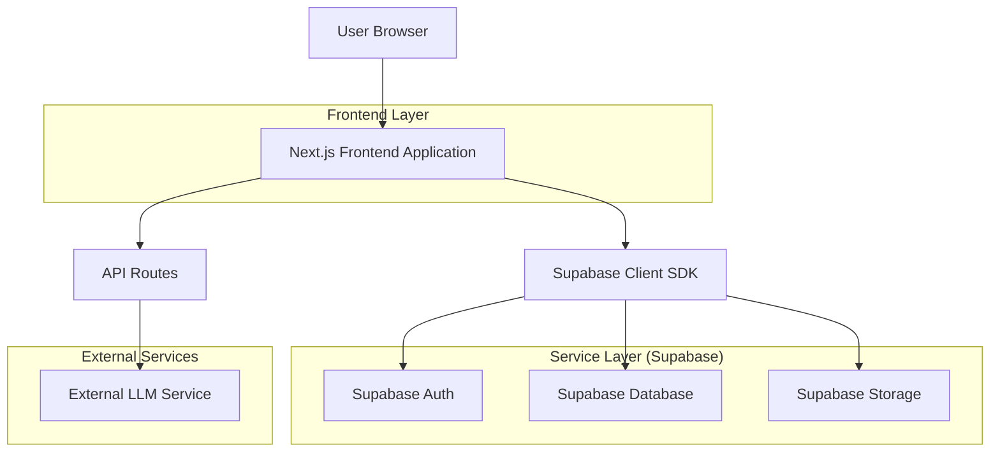
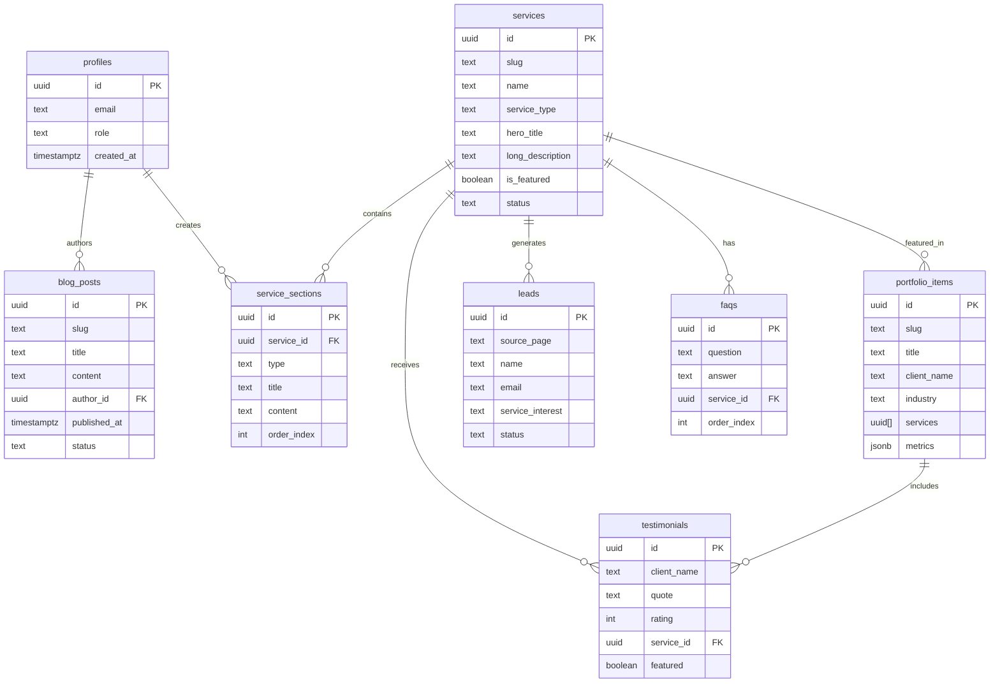

## 1. Architecture Design



## 2. Technology Description

* **Frontend**: Next.js 14 (App Router) + TypeScript + Tailwind CSS

* **Initialization Tool**: create-next-app

* **Backend**: Supabase (PostgreSQL, Auth, Storage, Real-time)

* **Deployment**: Vercel (Frontend + API Routes)

* **AI Integration**: External LLM API via AI\_API\_KEY

## 3. Route Definitions

| Route                  | Purpose                                                          |
| ---------------------- | ---------------------------------------------------------------- |
| `/`                    | Homepage with hero section, core services, testimonials, and CTA |
| `/about`               | Company information and team details                             |
| `/services`            | Services overview with core and supporting service listings      |
| `/services/[slug]`     | Individual service detail pages with dynamic content             |
| `/portfolio`           | Portfolio project showcase with filtering                        |
| `/portfolio/[slug]`    | Individual project detail pages                                  |
| `/blog`                | Blog post listings with category filtering                       |
| `/blog/[slug]`         | Individual blog post pages                                       |
| `/testimonials`        | Client testimonials showcase                                     |
| `/contact`             | Contact information and form                                     |
| `/request-quotation`   | Dedicated quotation request form                                 |
| `/ai-diagnostic`       | Embedded AI diagnostic tool                                      |
| `/solutions`           | Supporting solutions overview                                    |
| `/admin/login`         | Admin authentication page                                        |
| `/admin/dashboard`     | Main CMS dashboard                                               |
| `/admin/services`      | Service management interface                                     |
| `/admin/services/[id]` | Individual service editing                                       |
| `/admin/portfolio`     | Portfolio project management                                     |
| `/admin/testimonials`  | Testimonial management                                           |
| `/admin/blog`          | Blog post management                                             |
| `/admin/leads`         | Lead management and CRM                                          |
| `/admin/settings`      | Site configuration management                                    |

## 4. API Definitions

### 4.1 Lead Capture API

```
POST /api/leads
```

Request:

| Param Name        | Param Type | isRequired | Description            |
| ----------------- | ---------- | ---------- | ---------------------- |
| name              | string     | true       | Client name            |
| email             | string     | true       | Client email address   |
| phone             | string     | false      | Client phone number    |
| company           | string     | false      | Client company name    |
| service\_interest | string     | false      | Service of interest    |
| budget\_range     | string     | false      | Budget range selection |
| message           | string     | false      | Additional message     |
| source\_page      | string     | true       | Source page URL        |
| campaign\_id      | string     | false      | Marketing campaign ID  |

Response:

| Param Name | Param Type | Description           |
| ---------- | ---------- | --------------------- |
| success    | boolean    | Operation status      |
| lead\_id   | string     | Created lead UUID     |
| message    | string     | Success/error message |

Example Request:

```json
{
  "name": "John Doe",
  "email": "john@company.com",
  "phone": "+60123456789",
  "company": "Tech Sdn Bhd",
  "service_interest": "web-app-software-development",
  "budget_range": "RM10k-50k",
  "message": "Need custom web application for inventory management",
  "source_page": "/services/web-app-software-development",
  "campaign_id": "google-ads-q4-2024"
}
```

### 4.2 Chatbot API

```
POST /api/chat
```

Request:

| Param Name       | Param Type | isRequired | Description                    |
| ---------------- | ---------- | ---------- | ------------------------------ |
| message          | string     | true       | User message                   |
| conversation\_id | string     | false      | Existing conversation ID       |
| context          | object     | false      | Additional context information |

Response:

| Param Name         | Param Type | Description                    |
| ------------------ | ---------- | ------------------------------ |
| response           | string     | AI-generated response          |
| conversation\_id   | string     | Conversation ID for continuity |
| suggested\_service | string     | Recommended service URL        |

## 5. Data Model

### 5.1 Database Schema



### 5.2 Data Definition Language

#### Profiles Table

```sql
-- Create profiles table
CREATE TABLE profiles (
    id UUID PRIMARY KEY DEFAULT gen_random_uuid(),
    email TEXT UNIQUE NOT NULL,
    role TEXT CHECK (role IN ('admin', 'editor', 'viewer')) DEFAULT 'viewer',
    created_at TIMESTAMPTZ DEFAULT NOW()
);

-- Grant permissions
GRANT SELECT ON profiles TO anon;
GRANT ALL ON profiles TO authenticated;
```

#### Services Table

```sql
-- Create services table
CREATE TABLE services (
    id UUID PRIMARY KEY DEFAULT gen_random_uuid(),
    slug TEXT UNIQUE NOT NULL,
    name TEXT NOT NULL,
    service_type TEXT CHECK (service_type IN ('core', 'supporting')) DEFAULT 'supporting',
    short_tagline TEXT,
    hero_title TEXT,
    hero_subtitle TEXT,
    long_description TEXT,
    icon TEXT,
    primary_cta_label TEXT,
    primary_cta_url TEXT,
    secondary_cta_label TEXT,
    secondary_cta_url TEXT,
    starting_price NUMERIC(10,2),
    is_featured BOOLEAN DEFAULT false,
    ad_landing_priority INT DEFAULT 100,
    status TEXT CHECK (status IN ('draft', 'published')) DEFAULT 'draft',
    created_at TIMESTAMPTZ DEFAULT NOW(),
    updated_at TIMESTAMPTZ DEFAULT NOW()
);

-- Create indexes
CREATE INDEX idx_services_slug ON services(slug);
CREATE INDEX idx_services_type ON services(service_type);
CREATE INDEX idx_services_featured ON services(is_featured);

-- Grant permissions
GRANT SELECT ON services TO anon;
GRANT ALL ON services TO authenticated;
```

#### Service Sections Table

```sql
-- Create service_sections table
CREATE TABLE service_sections (
    id UUID PRIMARY KEY DEFAULT gen_random_uuid(),
    service_id UUID REFERENCES services(id) ON DELETE CASCADE,
    type TEXT CHECK (type IN ('problem', 'benefits', 'process', 'features', 'pricing', 'faq', 'cta', 'custom')),
    title TEXT NOT NULL,
    content TEXT,
    order_index INT NOT NULL,
    created_at TIMESTAMPTZ DEFAULT NOW()
);

-- Create indexes
CREATE INDEX idx_service_sections_service_id ON service_sections(service_id);
CREATE INDEX idx_service_sections_order ON service_sections(order_index);

-- Grant permissions
GRANT SELECT ON service_sections TO anon;
GRANT ALL ON service_sections TO authenticated;
```

#### Portfolio Items Table

```sql
-- Create portfolio_items table
CREATE TABLE portfolio_items (
    id UUID PRIMARY KEY DEFAULT gen_random_uuid(),
    slug TEXT UNIQUE NOT NULL,
    title TEXT NOT NULL,
    client_name TEXT NOT NULL,
    industry TEXT,
    short_summary TEXT,
    full_story TEXT,
    services UUID[] REFERENCES services(id),
    metrics JSONB,
    thumbnail_url TEXT,
    gallery_urls TEXT[],
    published_at TIMESTAMPTZ,
    created_at TIMESTAMPTZ DEFAULT NOW()
);

-- Create indexes
CREATE INDEX idx_portfolio_slug ON portfolio_items(slug);
CREATE INDEX idx_portfolio_published ON portfolio_items(published_at);

-- Grant permissions
GRANT SELECT ON portfolio_items TO anon;
GRANT ALL ON portfolio_items TO authenticated;
```

#### Testimonials Table

```sql
-- Create testimonials table
CREATE TABLE testimonials (
    id UUID PRIMARY KEY DEFAULT gen_random_uuid(),
    client_name TEXT NOT NULL,
    role TEXT,
    company TEXT,
    quote TEXT NOT NULL,
    rating INT CHECK (rating >= 1 AND rating <= 5),
    logo_url TEXT,
    service_id UUID REFERENCES services(id),
    featured BOOLEAN DEFAULT false,
    created_at TIMESTAMPTZ DEFAULT NOW()
);

-- Create indexes
CREATE INDEX idx_testimonials_service_id ON testimonials(service_id);
CREATE INDEX idx_testimonials_featured ON testimonials(featured);

-- Grant permissions
GRANT SELECT ON testimonials TO anon;
GRANT ALL ON testimonials TO authenticated;
```

#### Leads Table

```sql
-- Create leads table
CREATE TABLE leads (
    id UUID PRIMARY KEY DEFAULT gen_random_uuid(),
    source_page TEXT NOT NULL,
    campaign_id TEXT,
    name TEXT NOT NULL,
    email TEXT NOT NULL,
    phone TEXT,
    company TEXT,
    service_interest TEXT,
    budget_range TEXT,
    message TEXT,
    status TEXT CHECK (status IN ('new', 'contacted', 'qualified', 'lost')) DEFAULT 'new',
    created_at TIMESTAMPTZ DEFAULT NOW()
);

-- Create indexes
CREATE INDEX idx_leads_email ON leads(email);
CREATE INDEX idx_leads_status ON leads(status);
CREATE INDEX idx_leads_created_at ON leads(created_at DESC);

-- Grant permissions
GRANT SELECT ON leads TO anon;
GRANT ALL ON leads TO authenticated;
```

#### RLS Policies

```sql
-- Enable RLS on all tables
ALTER TABLE profiles ENABLE ROW LEVEL SECURITY;
ALTER TABLE services ENABLE ROW LEVEL SECURITY;
ALTER TABLE service_sections ENABLE ROW LEVEL SECURITY;
ALTER TABLE portfolio_items ENABLE ROW LEVEL SECURITY;
ALTER TABLE testimonials ENABLE ROW LEVEL SECURITY;
ALTER TABLE leads ENABLE ROW LEVEL SECURITY;

-- Public read access for published content
CREATE POLICY "Public read for published services" ON services
    FOR SELECT USING (status = 'published');

CREATE POLICY "Public read for service sections" ON service_sections
    FOR SELECT USING (
        EXISTS (
            SELECT 1 FROM services 
            WHERE services.id = service_sections.service_id 
            AND services.status = 'published'
        )
    );

-- Admin full access
CREATE POLICY "Admin full access on services" ON services
    FOR ALL USING (
        EXISTS (
            SELECT 1 FROM profiles 
            WHERE profiles.id = auth.uid() 
            AND profiles.role = 'admin'
        )
    );
```

## 6. Supabase Configuration

### 6.1 Environment Variables

```bash
NEXT_PUBLIC_SUPABASE_URL=https://[your-project].supabase.co
NEXT_PUBLIC_SUPABASE_ANON_KEY=[your-anon-key]
SUPABASE_SERVICE_ROLE_KEY=[your-service-role-key]
AI_API_KEY=[your-llm-api-key]
```

### 6.2 Storage Buckets

* **portfolio-images**: For portfolio item thumbnails and gallery images

* **blog-images**: For blog post featured images

* **testimonial-logos**: For client company logos

* **service-icons**: For service icons and illustrations

### 6.3 Auth Configuration

* Email-based authentication with role assignment

* Automatic profile creation on signup

* Role-based access control for admin routes

