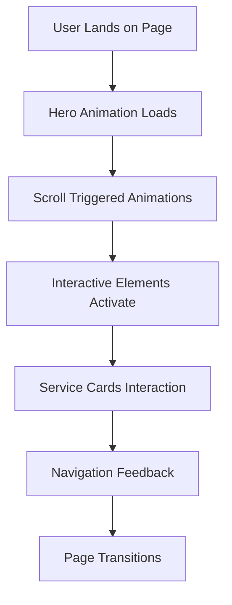

## 1. Product Overview
Enhance the visual appearance of JOeve Smart Solutions Website through improved hero visuals, motion design, and interactive elements. This enhancement focuses on creating a strong visual impact while maintaining optimal performance and responsiveness across all devices.

The goal is to transform the current visual presentation into a more engaging, modern, and memorable experience that effectively communicates the company's smart solutions offerings.

## 2. Core Features

### 2.1 Visual Enhancement Areas
Our visual enhancement requirements consist of the following main areas:

1. **Hero Section Visuals**: Dynamic backgrounds, animated elements, and compelling imagery
2. **Motion Design**: Smooth transitions, scroll-triggered animations, and micro-interactions
3. **Interactive Elements**: Hover effects, click animations, and user-triggered visual feedback
4. **Service Showcase**: Enhanced visual presentation for each service offering
5. **Performance Optimization**: Maintaining fast load times despite visual enhancements

### 2.2 Page Details
| Page Name | Module Name | Feature description |
|-----------|-------------|---------------------|
| Home Page | Hero Section | Implement dynamic background with subtle parallax effect, animated text reveals, and floating elements that respond to mouse movement |
| Home Page | Service Cards | Add 3D tilt effects on hover, smooth color transitions, and animated icons that activate on scroll |
| Home Page | Navigation | Implement sticky header with blur effect, smooth scroll animations, and active section highlighting |
| Service Pages | Hero Banners | Create unique animated backgrounds for each service with relevant visual metaphors |
| Service Pages | Content Sections | Add staggered animations for content reveals, interactive infographics, and progress indicators |
| All Pages | Loading States | Implement skeleton screens, smooth page transitions, and loading animations |
| All Pages | Interactive Elements | Add ripple effects on buttons, form field animations, and feedback micro-interactions |

### 2.3 Performance Features
| Feature Category | Feature Name | Feature description |
|----------------|--------------|---------------------|
| Optimization | Image Optimization | Implement lazy loading, WebP format, and responsive image sizing |
| Animation | CSS vs JS | Prioritize CSS animations for simple effects, reserve JavaScript for complex interactions |
| Loading | Code Splitting | Implement component-based code splitting for faster initial load |
| Caching | Asset Caching | Configure proper cache headers for static assets and animations |

## 3. Core Process
User experience flow with enhanced visuals:

1. **Landing Experience**: User arrives to see animated hero section with dynamic background
2. **Scroll Journey**: Content reveals smoothly as user scrolls with staggered animations
3. **Service Exploration**: Interactive service cards respond to hover with 3D effects
4. **Navigation**: Smooth transitions between sections with visual feedback
5. **Mobile Experience**: Touch-optimized interactions with reduced motion options

## 4. User Interface Design

### 4.1 Design Style
- **Primary Colors**: Deep blue (#1a365d) with electric blue (#3182ce) accents
- **Secondary Colors**: Gradient overlays from purple to blue for dynamic effects
- **Animation Style**: Smooth easing curves (cubic-bezier), 60fps target, sub-300ms duration
- **Typography**: Bold, modern fonts with animated text reveals
- **Icon Style**: Line icons with animated fills and morphing capabilities
- **Layout**: Layered depth with parallax and floating elements

### 4.2 Page Design Overview
| Page Section | Module Name | UI Elements |
|--------------|-------------|-------------|
| Hero Section | Background | Animated gradient mesh, floating geometric shapes, subtle particle effects |
| Hero Section | Text Content | Typewriter effect for headlines, fade-in for subtext, animated CTAs |
| Service Cards | Container | 3D perspective transform, shadow animations, border glow effects |
| Service Cards | Icons | SVG animations, morphing between states, color transitions |
| Navigation | Header | Blur backdrop, slide-down animation, active indicator animations |
| Buttons | Primary CTA | Ripple effect on click, hover state transformations, loading animations |

### 4.3 Responsiveness
- **Desktop-First**: Full animation suite with complex motion graphics
- **Tablet**: Reduced motion complexity, simplified interactions
- **Mobile**: Minimal animations, touch-optimized interactions, reduced motion support
- **Performance**: Progressive enhancement based on device capabilities

### 4.4 Animation Guidelines
- **Duration**: 200-400ms for micro-interactions, 800-1200ms for page transitions
- **Easing**: Custom cubic-bezier curves for natural motion feel
- **Performance**: GPU-accelerated transforms, will-change optimization
- **Accessibility**: Respect prefers-reduced-motion, provide animation toggle
- **Fallback**: Static designs for older browsers, graceful degradation