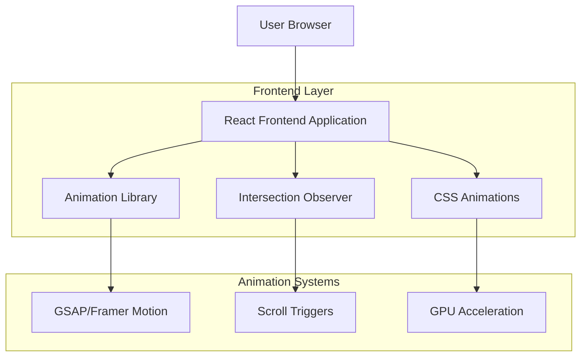
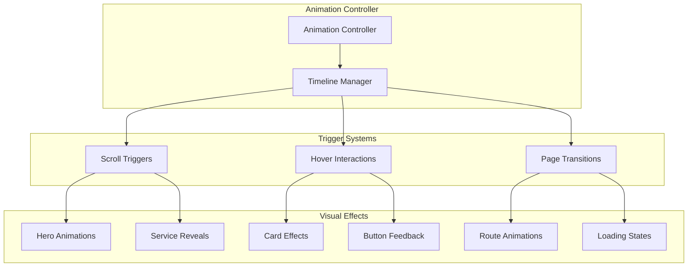

## 1. Architecture Design



## 2. Technology Description

- **Frontend**: React@18 + tailwindcss@3 + vite
- **Initialization Tool**: vite-init
- **Animation Libraries**: 
  - framer-motion@10 (primary animation library)
  - @react-spring/web (secondary for complex physics)
  - three@0.158 (for 3D background elements)
  - @react-three/fiber (React integration for 3D)
  - @react-three/drei (3D utilities and helpers)
- **Performance Tools**:
  - react-intersection-observer (scroll triggers)
  - react-lazyload (component lazy loading)
  - react-virtualized (for long lists)
- **Backend**: None (frontend-only enhancement)

## 3. Route Definitions

| Route | Purpose |
|-------|---------|
| / | Enhanced homepage with animated hero and service sections |
| /services/ai-automation | AI automation service page with custom animations |
| /services/smart-home | Smart home service page with interactive demonstrations |
| /services/iot-solutions | IoT solutions page with animated infographics |
| /services/data-analytics | Data analytics page with dynamic visualizations |
| /contact | Contact page with form animations and feedback |

## 4. Component Architecture

### 4.1 Core Animation Components

```typescript
interface AnimationConfig {
  duration: number;
  easing: string;
  delay?: number;
  stagger?: number;
}

interface HeroAnimationProps {
  backgroundType: 'gradient' | 'particles' | '3d';
  textAnimation: 'typewriter' | 'fadeIn' | 'slideUp';
  parallaxIntensity: number;
}

interface ServiceCardProps {
  icon: React.ReactNode;
  title: string;
  description: string;
  animationVariant: 'tilt' | 'float' | 'morph';
}
```

### 4.2 Performance Monitoring

```typescript
interface PerformanceMetrics {
  animationFrameRate: number;
  renderTime: number;
  interactionDelay: number;
  memoryUsage: number;
}

interface AnimationController {
  start(): void;
  pause(): void;
  reverse(): void;
  updateSpeed(factor: number): void;
}
```

## 5. Animation System Architecture



## 6. Performance Optimization Strategy

### 6.1 Asset Loading Strategy
- **Critical CSS**: Inline above-the-fold styles
- **Font Loading**: Font-display: swap with preloading
- **Image Optimization**: WebP format with responsive sizing
- **Code Splitting**: Route-based and component-based splitting
- **Preloading**: Prefetch next route animations

### 6.2 Animation Performance
- **GPU Acceleration**: Transform3d() for all animations
- **Will-change**: Optimize for animated properties
- **RAF Scheduling**: Use requestAnimationFrame for smooth updates
- **Memory Management**: Cleanup animation instances on unmount
- **Reduced Motion**: Respect user preferences

### 6.3 Bundle Size Optimization
```javascript
// Dynamic imports for heavy libraries
const ThreeScene = lazy(() => import('./components/ThreeScene'));
const HeavyAnimation = lazy(() => import('./components/HeavyAnimation'));

// Conditional loading based on device
const loadAnimations = () => {
  if (window.matchMedia('(prefers-reduced-motion: reduce)').matches) {
    return import('./animations/reduced-motion');
  }
  return import('./animations/full-motion');
};
```

## 7. Browser Compatibility Matrix

| Feature | Chrome 90+ | Firefox 88+ | Safari 14+ | Edge 90+ | Mobile |
|---------|------------|-------------|------------|----------|---------|
| CSS Grid | ✓ | ✓ | ✓ | ✓ | ✓ |
| CSS Animations | ✓ | ✓ | ✓ | ✓ | ✓ |
| Intersection Observer | ✓ | ✓ | ✓ | ✓ | ✓ |
| WebGL (Three.js) | ✓ | ✓ | ✓ | ✓ | ⚠️ |
| WebP Images | ✓ | ✓ | ✓ | ✓ | ⚠️ |
| CSS Variables | ✓ | ✓ | ✓ | ✓ | ✓ |

## 8. Fallback Strategy

### 8.1 Progressive Enhancement
- **Basic Experience**: Static layouts with hover effects
- **Enhanced Experience**: Smooth animations and interactions
- **Premium Experience**: 3D effects and complex motion graphics

### 8.2 Error Boundaries
```typescript
interface AnimationErrorBoundaryState {
  hasError: boolean;
  fallbackToStatic: boolean;
}

class AnimationErrorBoundary extends Component<Props, State> {
  componentDidCatch(error: Error) {
    this.setState({ hasError: true, fallbackToStatic: true });
    console.warn('Animation failed, falling back to static:', error);
  }
}
```

## 9. Testing Strategy

### 9.1 Performance Testing
- **Lighthouse CI**: Automated performance regression testing
- **WebPageTest**: Detailed animation performance metrics
- **Browser DevTools**: Frame rate and paint profiling

### 9.2 Cross-browser Testing
- **Playwright**: Automated visual regression testing
- **Manual Testing**: Device-specific interaction testing
- **Accessibility**: Screen reader and keyboard navigation testing